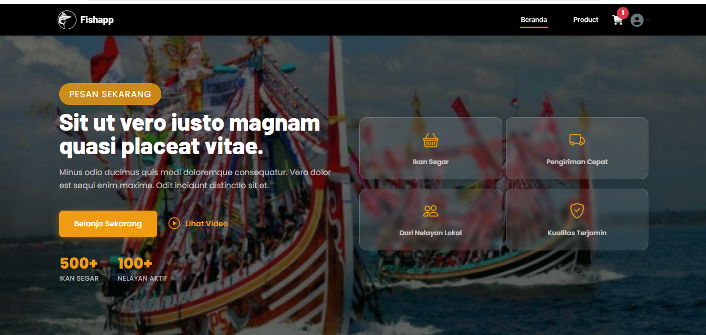

# 🐟 JD Mohammad Fajar Rosyidi Fish - Web App

Website aplikasi penjualan ikan berbasis **Laravel 12**, **Inertia.js**, dan **Vue 3**.  
Dibuat sebagai bagian dari kompetisi, aplikasi ini mendukung fitur **multi-role (Admin, Super Admin, Guide, Customer)**, pengelolaan produk, checkout, pengaturan situs, dan integrasi pembayaran.

---

## 🚀 Fitur Utama

- **Landing Page & Produk**  
  Halaman utama dan katalog produk dengan filter kategori.

- **Checkout & Keranjang**  
  Proses belanja, keranjang, dan checkout dengan pilihan kurir (RajaOngkir / Xendit).

- **Manajemen User**  
  Admin dapat mengelola user dan role.

- **Pengaturan Situs & Hero**  
  Admin dapat mengubah logo, deskripsi, kontak, media sosial, dan hero section.

- **Autentikasi**  
  Login, register, dan proteksi halaman sesuai role.

- **Integrasi Pembayaran**  
  Mendukung pembayaran dengan notifikasi status order.

- **Alamat & Pengiriman**  
  Integrasi data wilayah Indonesia menggunakan Laravolt Indonesia.

- **Media Library**  
  Upload dan manajemen media (logo, gambar produk, dsb).

- **Dark Mode**  
  Dukungan tema gelap/terang.

---

## 🛠️ Teknologi yang Digunakan

### Backend
- Laravel 12
- Inertia.js
- Sanctum
- Spatie Permission
- Media Library
- Laravolt Indonesia
- Xendit Payment Gateway

### Frontend
- Vue 3 (Composition API)
- TailwindCSS
- Vite
- Pinia (state management)
- Flowbite (komponen UI)
- AOS (animasi scroll)

### Lainnya
- Testing: PHPUnit
- Dev Tools: Laravel Breeze, Pint, Sail, Pail, concurrently

---

## 📂 Struktur Folder

app/ -> Model, Service, Controller, Request, Enum, Provider, Mail
resources/js -> Komponen Vue, Layout, Pages, Store (Pinia)
routes/ -> web.php, api.php, auth.php, console.php
database/ -> migration, seeder, factory
public/ -> asset publik, gambar, favicon
config/ -> konfigurasi Laravel & package
tests/ -> Unit & Feature test


---

## ⚙️ Instalasi

1. **Clone repo & masuk folder**
   ```bash
   git clone https://github.com/username/fishapp.git
   cd fishapp
   cp .env.example .env
   composer install
   npm install
   php artisan key:generate
   php artisan migrate
   php artisan db:seed
   php artisan serve
   npm run dev
---

##
flowchart TD
  A[Customer pilih produk] --> B[Tambah ke keranjang]
  B --> C[Pilih alamat pengiriman]
  C --> D[Pilih kurir & layanan]
  D --> E[Hitung biaya ongkir]
  E --> F[Pilih metode pembayaran (Xendit)]
  F --> G[Proses pembayaran]
  G --> H{Pembayaran sukses?}
  H -->|Ya| I[Order diproses]
  H -->|Tidak| J[Order gagal]
  I --> K[Customer menerima notifikasi]
  J --> K


---

## 📸 Dokumentasi Screenshot

Berikut adalah beberapa tampilan aplikasi:




